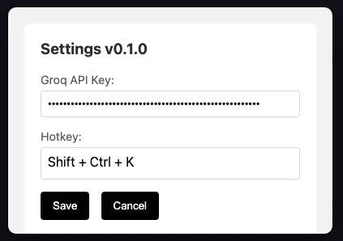

# WhisperAnywhere: Your Voice, Everywhere


WhisperAnywhere is a powerful, system-wide speech-to-text tool that lets you dictate text anywhere on your Mac. With just a hotkey, you can start talking and watch your words appear in any text input field, regardless of the application you're using.

## Features

- 🎙️ System-wide audio recording with a customizable hotkey
- 🧠 Advanced speech recognition powered by Whisper AI model
- ⚡ Fast transcription using the Groq API (with plans for OpenAI and local MLX Whisper)
- 📝 Seamless text insertion into any active text field
- ⚙️ Easy-to-use settings interface for API key and hotkey configuration
- 🍎 Currently available for macOS (Windows support coming soon)

## Installation

### Option 1: Pre-compiled Version (macOS)

1. Download the pre-compiled WhisperAnywhere app from the releases page [Whisper.Anywhere-darwin-arm64-1.0.0.zip
](https://github.com/unclecode/whisperanywhere/releases/download/v1.0.0-pre/Whisper.Anywhere-darwin-arm64-1.0.0.zip).
2. Unzip the downloaded file.
3. Drag the WhisperAnywhere app to your Applications folder.
4. Double-click to open the app.

### Option 2: Build from Source

See the "Building from Source" section below.

## Required Permissions

WhisperAnywhere requires two important permissions to function correctly:

1. **Microphone Access**: To record your voice for transcription.
2. **Accessibility Access**: To paste the transcribed text into any application.

When you first run WhisperAnywhere, it will prompt you to grant these permissions. If you miss these prompts, you can grant them manually:

1. Go to System Preferences > Security & Privacy > Privacy.
2. In the left sidebar, click on "Microphone" and ensure WhisperAnywhere is checked.
3. In the same sidebar, click on "Accessibility" and ensure WhisperAnywhere is checked.

**Note**: If you don't see WhisperAnywhere in these lists, you may need to add it manually by clicking the "+" button and navigating to the app in your Applications folder.

## Usage

1. Open WhisperAnywhere. It will appear in your menu bar.
2. Click on the WhisperAnywhere icon and select "Settings" to configure your Groq API key and preferred hotkey.
3. In any application, place your cursor where you want to insert text.
4. Press your configured hotkey to start recording.
5. Speak clearly into your microphone.
6. Press the hotkey again to stop recording. WhisperAnywhere will process your speech and insert the transcribed text at the cursor position.

## Configuration



- **Groq API Key**: Enter your Groq API key here. You can obtain one from [Groq's website](https://www.groq.com).
- **Hotkey**: Set your preferred hotkey combination for starting and stopping recording.

## Upcoming Features

- OpenAI API integration for alternative transcription options
- Local MLX Whisper support for offline transcription
- Custom fine-tuning options for improved accuracy
- Windows support

## Building from Source

If you'd like to compile WhisperAnywhere yourself:

1. Clone the repository:
   ```
   git clone https://github.com/yourusername/whisperanywhere.git
   ```
2. Navigate to the project directory:
   ```
   cd whisperanywhere
   ```
3. Install dependencies:
   ```
   npm install
   ```
4. Build the application:
   ```
   npm run make
   ```

## Contributing

Contributions are welcome! Please feel free to submit a Pull Request.

## License

[MIT License](LICENSE)

## Support

If you encounter any issues or have questions, please [open an issue](https://github.com/yourusername/whisperanywhere/issues) on our GitHub repository.

---

WhisperAnywhere - Empowering your voice in every application!